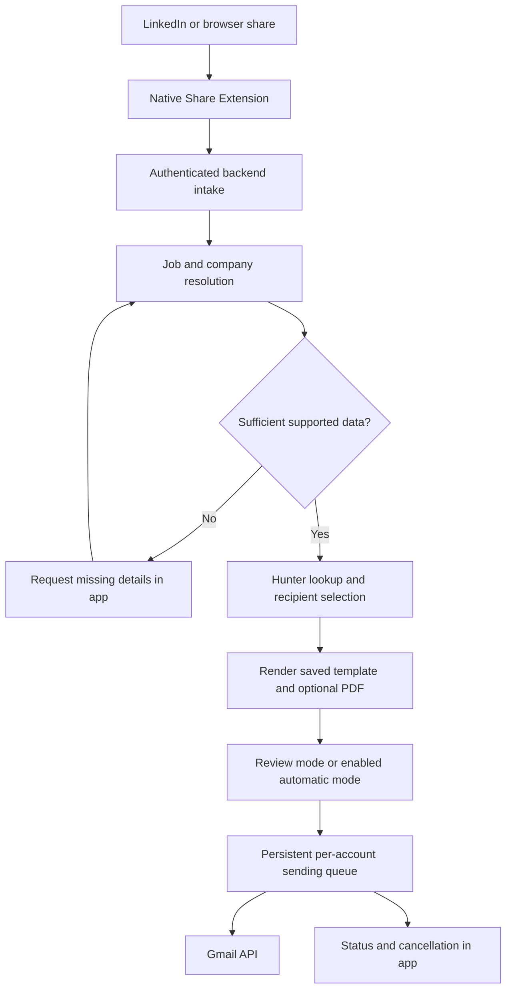

# iOS job referral outreach app — feasibility and build plan

Date: September 14, 2026

Status: implementation started after approval. This document records the original design baseline; see README.md for the current native app, share extension, backend, and setup instructions. A physical LinkedIn share, live provider integration, and App Store acceptance remain unverified.

## Decision

Proceed with a small feasibility prototype. The native sharing, templates, optional PDF attachment, and Gmail sending are buildable. Two dependencies determine whether the exact public product can ship: a permitted, sufficiently reliable job-data source and acceptance of the contact-discovery use case by distribution and email providers.

The intended experience remains: configure once, share a job, and let the selected automation run. Automatic sending is technically possible. The initial test build should use preview mode so extraction and recipient selection can be measured before enabling it for real recipients.

## User experience

Setup:

- Connect Gmail and choose the sending account.
- Enter a personal Hunter API key and validate access.
- Save a subject and message template.
- Import an optional PDF resume and select whether it is attached by default.
- Choose a contact limit, recipient preferences, sending interval, and daily budget.
- Choose review-before-send or automatic sending after a share. Automatic mode explicitly authorizes use of these saved settings, subject to provider and distribution requirements.

For each job:

1. Share a URL from LinkedIn or a browser, or paste it into the app.
2. The share panel shows the active sending settings and accepts the job for processing.
3. Resolve the job title, employer, company domain, location, and available description. Retain the source and confidence of each field.
4. Find matching contacts and build an individual message for each eligible recipient.
5. In review mode, present editable messages. In automatic mode, queue complete, sufficiently supported results under the saved settings.
6. Display progress in the app. If source data is incomplete, show a specific correction request before spending contact credits or sending.

Suggested app sections: Jobs, Outreach, Templates, Resume, and Settings. Replies arrive in the user's Gmail inbox in the first release.

## Architecture

Proposed implementation: SwiftUI app, native Share Extension, App Group storage for pending imports, a TypeScript API and worker, PostgreSQL for persistent state, and private object storage for resume versions. Hosting provider remains an implementation choice.

Initial implementation adjustment: use dependency-free Node.js modules and a single-process encrypted persistent store for the first controlled pilot. This keeps the service runnable with the available toolchain. Migration to PostgreSQL and private object storage is required before operating multiple server replicas.

All interaction happens through the iPhone app. A small backend continues processing independently of the phone after it receives the job. Hunter and Gmail also process data in their own cloud services. A device-only alternative could pause and resume work, but would weaken the promise that sending continues after the app closes.

Apple documents URL/text extension activation and short-lived share handling. Newer continued-processing APIs permit some user-started background work, but do not provide a durable mail scheduler. [Extension activation](https://developer.apple.com/library/archive/documentation/General/Reference/InfoPlistKeyReference/Articles/AppExtensionKeys.html), [Share Extensions](https://developer.apple.com/library/archive/documentation/General/Conceptual/ExtensibilityPG/Share.html), [Continued processing](https://developer.apple.com/documentation/backgroundtasks/bgcontinuedprocessingtask).

## Job-data resolution

The extension receives the source app's supplied URL/text; it does not inherit LinkedIn's login session or page contents. Actual current LinkedIn payloads need an on-device experiment.

Resolve information from shared material the user is entitled to provide and permitted employer/ATS sources or a licensed provider whose coverage and terms fit this app. Validate any match against title, employer, location, and requisition identifiers. An opaque LinkedIn job ID alone may be insufficient. In that case ask for the company/title, pasted description, or original employer listing.

LinkedIn restricts unauthorized scraping, and its documented Talent integrations require approved access. An API for managing partner job postings does not establish permission to retrieve any job URL. A paid scraper or AI model is not a substitute for that permission. [LinkedIn restrictions](https://www.linkedin.com/help/linkedin/answer/a1341387/prohibited-software-and-extensions?lang=en), [API access](https://learn.microsoft.com/en-us/linkedin/shared/authentication/getting-access).

Start with a small set of explicitly supported source types. Store source-specific extraction separately so unsupported or changed pages produce an actionable failure. Treat imported text as data; it must never change recipient rules, send limits, or credentials.

## Contact count and relevance

Hunter Domain Search can filter by seniority, department, and job title, with a result limit. Its decision-maker field concerns likely buying authority; it does not identify the hiring manager for this requisition. [Hunter API](https://hunter.io/api-documentation).

Interpret the user's example as a maximum of five retrieved email addresses and at most five recipients for that job. Apply filters before requesting results. Keep a cumulative lookup budget across queries; do not silently retrieve a much larger pool. If the user later chooses a larger search budget for stronger ranking, expose that choice separately from the send limit.

Rank available results using department relevance, suitable seniority, title relevance, and available evidence of current employment. A senior engineer may be a stronger referral contact than a finance executive for an engineering role. Label results as recommended contacts, with reasons, rather than the company's definitive top five.

Exclude duplicates, suppressed recipients, and invalid addresses. Accept-all or unknown results should be held out of automatic sending. A valid verification result supports deliverability but does not establish current employment, hiring responsibility, or permission to contact. [Hunter verification explanation](https://help.hunter.io/en/articles/1830792-domain-search-find-emails-from-companies).

If only two contacts qualify, send to two and report the shortfall. Do not fill the remaining slots with unrelated people. API lookup limits and billable credits are distinct; show credit usage and stop on account exhaustion.

## Templates, Gmail, and sending

Use deterministic placeholders such as `{{first_name}}`, `{{company}}`, `{{job_title}}`, and `{{job_url}}`. Validate missing values and save the rendered message, sending account, and exact resume version before queueing. AI is optional for extraction or suggested edits; fixed templates do not require it.

Send separate messages, each with one recipient. Google documents MIME messages and attachments through `users.messages.send`; the PDF can be a normal attachment. [Gmail sending guide](https://developers.google.com/workspace/gmail/api/guides/sending).

Request `gmail.send` for the first release. It is a sensitive permission requiring the applicable public-app verification. Inbox reading and Gmail draft management add restricted permissions; keep drafts in this app and defer automatic reply/bounce detection. [Gmail scopes](https://developers.google.com/workspace/gmail/api/auth/scopes).

Use Google's server authorization flow for background access and protect backend refresh tokens. Keep local secrets in Keychain, redact credentials from logs, and bind every queued message to its selected account. [Google iOS server authorization](https://developers.google.com/identity/sign-in/ios/offline-access).

Five- or ten-second gaps can be implemented as minimum spacing. Provider limits, authorization failures, or temporary errors may delay sending further. The interval is not a deliverability guarantee or a way around Gmail limits. Google allows productivity uses such as delayed sending but prohibits spam and unsolicited commercial mail; its policy does not specifically classify every personal referral request. The actual use case needs accurate disclosure during verification. [Google policy](https://developers.google.com/workspace/workspace-api-user-data-developer-policy).

## Reliability requirements

- Persist imports locally until the backend acknowledges them. Show pending upload accurately when offline.
- Deduplicate repeated shares using user and canonical job identity; resolve aliases where supported.
- Deduplicate contacts per campaign and apply a visible cooldown across other jobs at the same company.
- Use a single sending lease per Gmail account, persistent due times, and bounded retry handling.
- Recheck cancellation, authorization, suppression, and budgets immediately before each send.
- Distinguish queued, processing, needs-details, ready, submitted-to-Gmail, failed, canceled, and uncertain outcomes.
- Cancellation stops remaining messages; a message already submitted cannot reliably be recalled.
- Never blindly retry a send that may have been accepted before a network timeout. Persist the attempt and mark it uncertain for checking in Gmail. A deterministic Message-ID is useful evidence, not a guaranteed Gmail deduplication mechanism.

The send API does not document an idempotency parameter. The ambiguous-outcome behavior above is an engineering precaution based on that API contract. Gmail acceptance is not proof of delivery or reading. [Send API](https://developers.google.com/workspace/gmail/api/reference/rest/v1/users.messages/send), [Gmail error handling](https://developers.google.com/workspace/gmail/api/guides/handle-errors).

## App Store dependency

Apple guideline 5.1.1(viii) restricts compiling personal information from outside sources, including public databases. This creates a material review question for Hunter contact discovery. Guideline 5.2.2 also requires authorized third-party service access. Assess the exact workflow and data rights early; sender permission or a Hunter key alone does not resolve the question. A preview screen does not guarantee approval. [Apple review guidelines](https://developer.apple.com/app-store/review/guidelines/#data-collection-and-storage).

Public release depends on resolving that fit, Google verification, and the chosen job-data access. Include appropriate data deletion and credential revocation in the production design. Do not assume a successful device demonstration proves App Store eligibility.

## Build sequence and checkpoints

1. **Prove import and data access.** Build a minimal URL/text extension. Test real LinkedIn jobs, hiring posts, and browser links across a representative sample (proposed: 20 jobs). Record payload fields, exact employer/role matches, and fallback frequency. Select the permitted enrichment source and assess the App Store dependency before broad implementation.
2. **Prove contact discovery.** With a supplied Hunter key, test company/domain resolution, the five-address budget, relevance, sparse results, stale roles, and verification outcomes. Measure cost per usable job and manually assess whether contacts are credible referral targets.
3. **Prove sending.** Connect a development Gmail account and send individually addressed messages only to designated test inboxes. Check sender identity, rendered fields, exact PDF contents, refresh-token behavior, and errors.
4. **Build the native workflow.** Implement settings, templates, resume import, job status, review mode, and explicit automatic-mode configuration. Integrate persistent processing and cancellation.
5. **Exercise failure paths.** Test duplicate shares, phone offline, app force-close, partial sends, expired access, exhausted Hunter credits, ambiguous company names, missing template values, and timeout-after-acceptance. Confirm limits hold and uncertain sends are not duplicated.
6. **Prepare distribution.** Complete provider verification, assess contact-data permissions with the actual product, and submit a reviewable build with accurate descriptions and working test access. Branding can be finalized after the workflow has proved useful.

Success means correct employer/role extraction or an explicit fallback, no more than the configured contact budget, useful recipient selection, correct individual messages and attachments, and clear status after interruption. Measure time saved and useful replies during a pilot; do not equate send volume with success.

## Deferred decisions

- Permitted provider and coverage for enriching LinkedIn-only URLs.
- Initial supported job sources and minimum iOS version, based on the device prototype.
- Production hosting, operating budget, and whether Hunter remains bring-your-own-key.
- Exact launch countries and provider/distribution acceptance.
- Whether multiple connected Gmail accounts are needed initially; every campaign always uses one explicitly selected account.
- Later inbox monitoring, follow-up sequences, optional AI personalization, and subscriptions.
